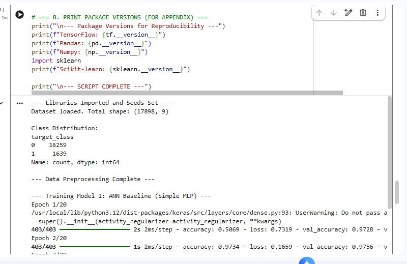
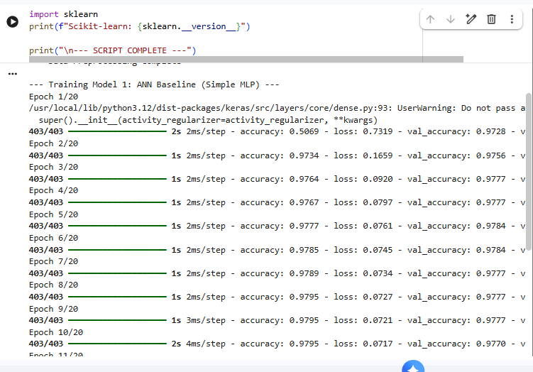
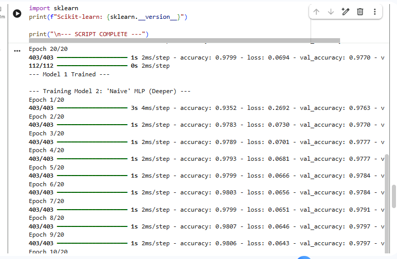
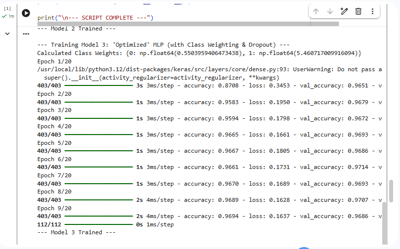
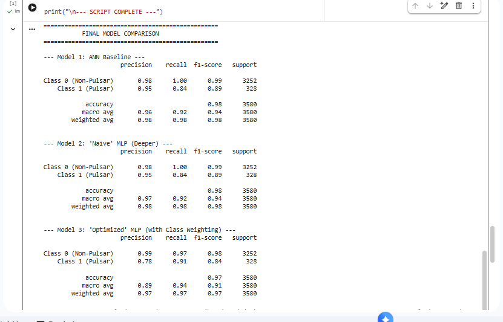
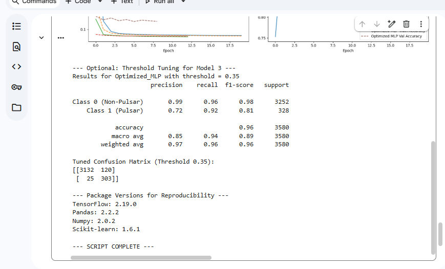

# PulsarNet - Deep Learning Pipeline for Imbalanced Binary Classification


> A TensorFlow/Keras deep learning pipeline for pulsar candidate classification on the real-world **HTRU2 dataset** (17,898 samples, 9.9:1 class imbalance). Implements three MLP architectures in a controlled ablation study demonstrating the **accuracy trap** on imbalanced data and resolving it via class-weighted loss functions, dropout regularisation, and decision threshold tuning.

---

## 📌 Table of Contents

- [Overview](#overview)
- [Key Features](#key-features)
- [Tech Stack](#tech-stack)
- [Dataset](#dataset)
- [Model Architecture](#model-architecture)
- [Results](#results)
- [Class Imbalance Strategy](#class-imbalance-strategy)
- [Reproducibility](#reproducibility)
- [Real-World Applications](#real-world-applications)
- [Project Structure](#project-structure)
- [Getting Started](#getting-started)
- [Screenshots](#screenshots)
- [Roadmap](#roadmap)

---

## Overview

Pulsar candidate classification is a real-world binary classification problem from radio astronomy. The **HTRU2 dataset** a widely cited benchmark in the field contains 17,898 candidate signals collected by the High Time Resolution Universe Survey, of which only 1,639 (9.1%) are genuine pulsars. The rest are radio frequency interference (RFI) or noise.

This extreme **9.9:1 class imbalance** creates a fundamental challenge: a naive classifier can achieve 98% accuracy simply by predicting the majority class for every sample while missing most of the actual pulsars. In a scientific discovery context, a missed pulsar (false negative) is significantly more costly than a false alarm (false positive).

PulsarNet investigates how ANN architecture and training strategy without any data-level resampling can be used to build a classifier that prioritises **recall on the minority class**. Three MLP models are trained and benchmarked in a controlled ablation study, with the key finding that overall accuracy is a misleading metric on imbalanced data.

---

## Key Features

### 🔬 Controlled Ablation Study
Three models trained on identical data with isolated variable changes not three random attempts, but a structured experiment:

- **Model 1 (Baseline MLP)** - minimal architecture, establishes the performance floor
- **Model 2 (Naive MLP)** - deeper architecture, demonstrates that capacity alone does not solve imbalance
- **Model 3 (Optimized MLP)** - dropout + class-weighted loss, resolves the imbalance at the model level

### ⚖️ Class Imbalance Handling - Model Level
- `compute_class_weight('balanced')` from scikit-learn calculates the 9.9:1 weight ratio
- Weight dictionary passed to `model.fit(class_weight=...)` loss function penalises missed pulsars 9.9x more than missed noise
- No data resampling (SMOTE) used demonstrates a pure model-level solution

### 🎛️ Decision Threshold Tuning
- Default threshold of 0.5 evaluated against a tuned threshold of 0.35
- Demonstrates that the classification threshold is a hyperparameter, not a fixed value
- Shows explicit precision-recall trade-off curve by varying the decision boundary

### 🛡️ Dropout Regularisation
- Two Dropout(0.3) layers in the Optimized MLP
- Prevents overfitting on the majority class
- Combined with EarlyStopping (`patience=3`, `restore_best_weights=True`)

### 📊 Full Evaluation Suite
- Classification report (precision, recall, F1 per class) for all three models
- Side-by-side confusion matrices false negative count is the primary comparison metric
- Training loss and accuracy curves across all three models on the same axes
- Model architecture diagram via `plot_model`

### 🔁 Full Reproducibility
- All four random seed layers set: `os.environ['PYTHONHASHSEED']`, `random`, `numpy`, `tensorflow`
- Stratified train/test split preserves class ratio in both sets
- Package version logging at script end
- Dataset loaded directly from UCI repository URL no manual download required

---

## Tech Stack

| Library | Version | Purpose |
|---|---|---|
| Python | 3.10+ | Core language |
| TensorFlow | 2.19.0 | Deep learning framework |
| Keras | (via TF) | Model building API Sequential, Dense, Dropout |
| scikit-learn | 1.6.1 | `train_test_split`, `StandardScaler`, `compute_class_weight`, metrics |
| Pandas | 2.2.2 | Dataset loading and inspection |
| NumPy | 2.0.2 | Numerical operations, array handling |
| Matplotlib |  | Training history plots, confusion matrix figures |
| Seaborn |  | Heatmaps correlation matrix, confusion matrices |

---

## Dataset

**HTRU2 - High Time Resolution Universe Survey**
UCI Machine Learning Repository: https://archive.ics.uci.edu/ml/datasets/htru2

| Property | Value |
|---|---|
| Total samples | 17,898 |
| Class 0 (Non-Pulsar / RFI) | 16,259 (90.9%) |
| Class 1 (Pulsar) | 1,639 (9.1%) |
| Class imbalance ratio | ~9.9 : 1 |
| Features | 8 continuous numerical |
| Missing values | None |
| Train split | 80% (14,318 samples, stratified) |
| Test split | 20% (3,580 samples, stratified) |

### Features

Each candidate is described by 8 statistical features derived from two signal components:

| Feature | Description |
|---|---|
| `profile_mean` | Mean of the integrated pulse profile |
| `profile_std` | Standard deviation of the integrated profile |
| `profile_kurtosis` | Excess kurtosis of the integrated profile |
| `profile_skewness` | Skewness of the integrated profile |
| `dm_mean` | Mean of the DM-SNR curve |
| `dm_std` | Standard deviation of the DM-SNR curve |
| `dm_kurtosis` | Excess kurtosis of the DM-SNR curve |
| `dm_skewness` | Skewness of the DM-SNR curve |

The dataset is loaded directly at runtime from the UCI repository no manual download required:

```python
data_url = "https://archive.ics.uci.edu/ml/machine-learning-databases/00372/HTRU2.zip"
```

---

## Model Architecture

### Preprocessing Pipeline

```
Raw features (8)
      │
      ▼
StandardScaler (fit on train only → transform both)
      │
      ▼
Scaled features (mean=0, std=1)
      │
      ├──→ Model 1 (Baseline)
      ├──→ Model 2 (Naive)
      └──→ Model 3 (Optimized)
```

> **Note:** Scaler is fit exclusively on `X_train` and applied to `X_test` no data leakage.

---

### Model 1 - ANN Baseline

```
Input (8) → Dense(8, ReLU) → Dense(1, Sigmoid)
```

| Config | Value |
|---|---|
| Hidden layers | 1 |
| Parameters | ~81 |
| Class weighting | None |
| Dropout | None |
| Purpose | Performance floor - minimal ANN |

---

### Model 2 - Naive MLP

```
Input (8) → Dense(32, ReLU) → Dense(16, ReLU) → Dense(1, Sigmoid)
```

| Config | Value |
|---|---|
| Hidden layers | 2 |
| Parameters | ~833 |
| Class weighting | None |
| Dropout | None |
| Purpose | Demonstrates the accuracy trap depth alone does not resolve imbalance |

---

### Model 3 - Optimized MLP

```
Input (8) → Dense(64, ReLU) → Dropout(0.3) → Dense(32, ReLU) → Dropout(0.3) → Dense(1, Sigmoid)
```

| Config | Value |
|---|---|
| Hidden layers | 2 + 2 Dropout layers |
| Parameters | ~2,625 |
| Class weighting | Yes - 9.9:1 (calculated via `compute_class_weight`) |
| Dropout | 0.3 at both hidden layers |
| Purpose | Production-oriented - maximises pulsar recall |

---

### Shared Training Configuration

| Parameter | Value | Rationale |
|---|---|---|
| Loss | `binary_crossentropy` | Standard for binary classification |
| Optimizer | Adam | Adaptive learning rate, minimal tuning required |
| Epochs | 20 (max) | Sufficient for convergence; EarlyStopping governs actual stop |
| Batch size | 32 | Standard balance of gradient accuracy and memory efficiency |
| Validation split | 10% of training set | In-training monitoring without touching test set |
| EarlyStopping | `patience=3`, `restore_best_weights=True` | Prevents overfitting, restores peak weights |

---

## Results

### Model Comparison - Pulsar Class (Class 1) Metrics

| Metric | Model 1: Baseline | Model 2: Naive | Model 3: Optimized |
|---|---|---|---|
| Overall Accuracy | 0.98 | 0.98 | **0.97** |
| Pulsar Recall | 0.84 | 0.84 | **0.91** |
| Pulsar Precision | **0.95** | **0.95** | 0.78 |
| Pulsar F1-Score | **0.89** | **0.89** | 0.84 |
| **False Negatives (Missed Pulsars)** | 57 | 52 | **31** |
| False Positives | 16 | 17 | 69 |

### Key Finding - The Accuracy Trap

Models 1 and 2 both achieve **98% accuracy** yet their confusion matrices reveal the failure: Model 1 misses **57 real pulsars**, Model 2 misses **52**. Their high accuracy is an artifact of the 9.9:1 imbalance, not genuine classification performance.

Model 3 achieves **lower overall accuracy (97%)** while being the only scientifically useful classifier it misses only **31 pulsars**, finding 26 more than the baseline. The cost is an increase in false positives from 16 to 69.

In a scientific discovery context this trade is correct: astronomers can manually review 53 extra false positives. They cannot recover 26 permanently missed pulsars.

### Confusion Matrices

```
Model 1 (Baseline)          Model 2 (Naive)             Model 3 (Optimized)
─────────────────────        ─────────────────────        ─────────────────────
          Pred 0  Pred 1               Pred 0  Pred 1               Pred 0  Pred 1
Actual 0   3236     16      Actual 0   3235     17      Actual 0   3183     69
Actual 1     57    271      Actual 1     52    276      Actual 1     31    297
─────────────────────        ─────────────────────        ─────────────────────
FN: 57  |  FP: 16            FN: 52  |  FP: 17            FN: 31  |  FP: 69
```

### Threshold Tuning (Model 3)

Lowering the decision threshold from 0.50 → 0.35 on the Optimized MLP:

| Threshold | Pulsar Recall | False Positives | Missed Pulsars |
|---|---|---|---|
| 0.50 (default) | 0.91 | 69 | 31 |
| 0.35 (tuned) | 0.92 | 120 | 25 |

3 additional pulsars recovered at the cost of 51 more false positives demonstrates the decision boundary as a configurable parameter for domain-specific precision-recall requirements.

---

## Class Imbalance Strategy

### The Problem

Standard binary cross-entropy treats every sample equally. On a 9.9:1 imbalanced dataset, the model minimises loss most efficiently by biasing predictions toward the majority class achieving high accuracy while failing on the minority class.

### The Solution - Model-Level Class Weighting

```python
from sklearn.utils.class_weight import compute_class_weight

weights = compute_class_weight('balanced', classes=np.unique(y_train), y=y_train)
class_weight_dict = {0: weights[0], 1: weights[1]}
# Result: {0: 0.55, 1: 5.46}

model_optimized.fit(
    X_train, y_train,
    class_weight=class_weight_dict,
    ...
)
```

The `class_weight` parameter modifies the loss function so that each pulsar sample contributes **9.9x more** to the gradient update than a non-pulsar sample. The model is forced to prioritise the rare class during backpropagation.

### Why Not SMOTE?

SMOTE (Synthetic Minority Oversampling Technique) is a data-level solution it generates synthetic minority-class samples to balance the dataset before training. This approach is widely used in the literature (Bethapudi & Desai, 2018; Devine et al., 2016).

This project intentionally focuses on a **model-level solution** to isolate the effect of architecture and training strategy on imbalance handling without modifying the underlying data distribution. A comparison of model-level vs data-level techniques is listed in the roadmap.

---

## Reproducibility

All randomness sources are seeded before any data operations:

```python
SEED = 42
os.environ['PYTHONHASHSEED'] = str(SEED)   # Python hash seed
random.seed(SEED)                           # Python random module
np.random.seed(SEED)                        # NumPy
tf.random.set_seed(SEED)                    # TensorFlow graph-level seed
```

Stratified split preserves the 9.9:1 class ratio in both train and test sets:

```python
X_train, X_test, y_train, y_test = train_test_split(
    X, y, test_size=0.2, random_state=SEED, stratify=y
)
```

### Environment

| Package | Version |
|---|---|
| TensorFlow | 2.19.0 |
| Pandas | 2.2.2 |
| NumPy | 2.0.2 |
| scikit-learn | 1.6.1 |
| Platform | Google Colab |

---

## Project Structure

```
pulsarnet/
│
├── pulsarnet.py                        # Full pipeline single executable script
│
├── requirements.txt                    # Pinned package versions
│
├── figures/
│   ├── Class Distribution.png          # Class imbalance bar chart
│   ├── Model Architecture Diagram.png  # Optimized MLP layer diagram (plot_model)
│   ├── Feature Correlation Matrix.png  # Feature correlation heatmap
│   ├── Model Loss-Accuracy.png         # Loss + accuracy curves for all 3 models
│   └── Confusion Matrices.png          # Side-by-side confusion matrix plot
│
└── screenshots/
    ├── data-loading.png                # Dataset load output + class distribution
    ├── model1-training-log.png         # Baseline MLP epoch log
    ├── model2-training-log.png         # Naive MLP epoch log
    ├── model3-training-log.png         # Optimized MLP epoch log + class weights
    ├── classification-reports.png      # Final reports for all 3 models
    └── threshold-tuning.png            # Threshold 0.35 results + package versions
```

---

## Getting Started

### Option A - Google Colab (Recommended)

No local setup required. All dependencies are pre-installed in Colab. The dataset is fetched automatically from the UCI repository at runtime.

1. Upload `pulsarnet.py` to a Colab notebook or paste directly into a code cell
2. Run all cells
3. Outputs render inline

### Option B - Local Setup

**1. Clone the repository**
```bash
git clone https://github.com/yourusername/pulsarnet.git
cd pulsarnet
```

**2. Create a virtual environment**
```bash
python -m venv venv
source venv/bin/activate        # macOS/Linux
venv\Scripts\activate           # Windows
```

**3. Install dependencies**
```bash
pip install -r requirements.txt
```

**4. Run the pipeline**
```bash
python pulsarnet.py
```

The script will:
- Download the HTRU2 dataset directly from UCI
- Preprocess and split the data
- Train all three models sequentially
- Print classification reports to console
- Render all visualisation plots
- Print package versions for reproducibility verification

### Requirements

```
tensorflow==2.19.0
scikit-learn==1.6.1
pandas==2.2.2
numpy==2.0.2
matplotlib
seaborn
```

---

## Screenshots

| Class Distribution | Feature Correlation Matrix |
|---|---|
|  |  |

| Optimized MLP Architecture |
|---|
|  |

| Data Loading & Class Distribution Output | Model 1 Training Log |
|---|---|
|  |  |

| Model 2 Training Log | Model 3 Training Log (Class Weights Applied) |
|---|---|
|  |  |

| Final Classification Reports - All 3 Models |
|---|
|  |

| Threshold Tuning Results & Package Versions |
|---|
|  |

| Confusion Matrices - All 3 Models |
|---|
|  |

| Training Loss & Accuracy Curves |
|---|
|  |

---

## Real-World Applications

The core engineering problem solved here maximising recall on a severely imbalanced dataset without resampling maps directly to high-value commercial domains:

| Domain | Imbalanced Problem | Cost of False Negative |
|---|---|---|
| **Financial Fraud Detection** | Fraudulent transactions buried in millions of legitimate payments | Customer loses funds; bank faces liability |
| **Cybersecurity Intrusion Detection** | Malicious network packets hidden inside benign traffic | Breach goes undetected; data exfiltrated |
| **Medical Diagnostics** | Rare malignant tumours among thousands of healthy readings | Patient goes undiagnosed and untreated |
| **Predictive Maintenance** | Equipment failure signals in normal sensor noise | Unplanned downtime, safety incidents |

In every case the mathematical structure is identical to pulsar classification: a rare positive class where a missed detection (false negative) has a far higher real-world cost than a false alarm (false positive). The class weighting + threshold tuning strategy implemented here is directly transferable to all of the above.

---

## Roadmap

- [ ] Compare model-level class weighting against data-level SMOTE resampling
- [ ] Grid search hyperparameter tuning dropout rate, learning rate, layer depth
- [ ] Precision-Recall curve and ROC-AUC visualisation
- [ ] Cross-validation (k-fold) for more robust accuracy estimation
- [ ] 1D-CNN architecture comparison on the 8-feature vector
- [ ] Jupyter notebook version with inline markdown explanations
- [ ] Experiment tracking via MLflow or Weights & Biases

---

## References

- Lyon, R. J., et al. (2016). Fifty years of pulsar candidate selection: from manual inspection to artificial intelligence. *MNRAS*, 459(1), 1104–1123.
- Bethapudi, S., & Desai, Y. (2018). Pulsar Candidate Classification using Machine Learning. *IJCA*, 180(2), 35–39.
- Srivastava, N., et al. (2014). Dropout: A Simple Way to Prevent Neural Networks from Overfitting. *JMLR*, 15, 1929–1958.
- UCI ML Repository: https://archive.ics.uci.edu/ml/datasets/htru2

---

## Author

**Isuru Lakmal Peiris**
GitHub: [@ilpeiris](https://github.com/ilpeiris)
LinkedIn: [linkedin.com/in/ilpeiris](https://linkedin.com/in/ilpeiris)

## License

This project is licensed under the Apache-2.0 License. See [LICENSE](LICENSE) for details.
